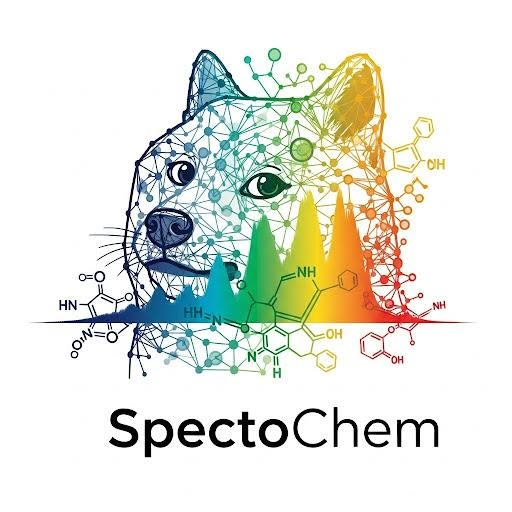

# SpectoChem

> **Predicting Photocatalytic Properties of Transition Metal Complexes from Geometric Structure**



---

## Introduction

The detection of chemical photocatalysts is one of the key challenges in materials chemistry, given their wide-ranging applications in fields such as energy conversion, environmental protection, CO₂ reduction, fertilizer synthesis, and advanced organic transformations. Current methods for identifying new photocatalysts rely on time-consuming experiments and computationally expensive quantum chemistry calculations that can take many hours per molecule.

In response to these challenges, we present **SpectoChem** — a machine learning system that enables the rapid detection of molecules with photocatalytic properties based on the fundamental geometric characteristics of their 3D structure. By leveraging graph neural networks (GNNs), SpectoChem predicts absorption spectra and photocatalytic activity directly from molecular geometry, bypassing the need for costly quantum mechanical computations.

---

## Key Features

- **Geometry-Driven Predictions**: Uses only 3D atomic coordinates and atomic numbers to predict photocatalytic properties — no manual feature engineering required.
- **Dual Prediction Modes**:
  - **Binary Classification**: Determine whether a molecule is a potential photocatalyst (has absorption in the visible range with sufficient oscillator strength).
  - **Regression**: Predict detailed excitation energies and oscillator strengths for the first 10 excited states, enabling full spectrum reconstruction via Gaussian broadening.
- **Multiple Model Architectures**: Supports SchNet, GCN, GAT, and GINE backbones for comprehensive benchmarking.
- **Pre-trained Models**: Model weights available on [Hugging Face](https://huggingface.co/SpectoChem).

## Architecture

The SpectoChem pipeline transforms raw molecular data into photocatalytic predictions through the following stages:


### Detailed Pipeline

1. **Input**: Molecule as 3D atomic coordinates (x, y, z) and atomic numbers
2. **Graph Construction**: Build molecular graph with edges based on distance cutoff (default: 10.0 Å)
3. **Node Embedding**: Embed atomic numbers as initial vertex features
4. **Message Passing**: GNN layers propagate geometric and chemical information across the graph
5. **Readout**: Pool vertex representations into a single graph-level embedding
6. **Prediction Head**: Task-specific output layer (binary classification or regression)

---

## Installation & Setup

### Environment Setup

```bash
# Clone the repository
git clone https://github.com/rwozn/SpectoChem.git
cd SpectoChem

# Create virtual environment
python3 -m venv .venv
source .venv/bin/activate

# Install dependencies
pip install -r requirements.txt
```

### Model Access (UMA Backbone)

For experiments using the UMA backbone, you need to request access to the gated model on Hugging Face:

1. Go to [facebook/UMA](https://huggingface.co/facebook/UMA) and fill out the model access form
2. Wait for approval at [Hugging Face Settings](https://huggingface.co/settings/gated-repos)
3. Authenticate using one of the following methods:

```bash
# Option 1: One-time CLI authentication
huggingface-cli login

# Option 2: Environment variable (for scripts)
HF_TOKEN=your_token_here python script.py
```

---

## Usage

### Quick Start — Binary Classification

Determine whether a molecule is a photocatalyst:

```bash
PYTHONPATH=. python experiments/scripts/train_graph_level.py     +exp=TMQM_SPECTO_BINARY     model=supervised_graph_level     backbone@model.backbone=schnet     model.backbone.disable_pos=True     training.experiment_name=path/to/exp     training.random_seed=42
```

### Quick Start — Regression (Spectrum Prediction)

Predict excitation energies and oscillator strengths:

```bash
PYTHONPATH=. python experiments/scripts/train_graph_level.py     +exp=TMQM_SPECTO_PAIRS     model=supervised_graph_level     backbone@model.backbone=schnet     model.backbone.disable_pos=True     training.experiment_name=path/to/exp     training.random_seed=42
```

### Precomputing Embeddings

For large-scale experiments, precompute molecular embeddings to accelerate training:

```bash
PYTHONPATH=. python experiments/scripts/precompute_embeddings.py     dataset=TMQM_SPECTO_LAMBDA_BINARY     backbone=uma
```

---

## Dataset

Experiments are conducted on the **tmQMg\*** dataset, one of the largest publicly available collections of transition metal complex quantum mechanical data:

| Property | Value |
|----------|-------|
| **Type** | Organic transition metal complexes |
| **Size** | 74,273 molecules |
| **Geometry** | DFT-optimized 3D structures |
| **Properties** | Excited states (λ, f), ground-state properties |
| **Source** | Quantum chemistry (TD-DFT) |

Each molecule contains up to 30 excited states; we select the first 10 for modeling. The dataset is split ensuring **isomers are never separated across train/validation/test sets** to prevent data leakage.

---

## Results & Performance

### Binary Classification (F1 Score)

Evaluation on tmQMg\* dataset. A molecule is positive if λ ∈ [350, 650] nm and f > 0.01.

| Model | Train & Test: Block 3 | Test Only: Block 3 |
|:------|:---------------------:|:------------------:|
| **SchNet** | **0.783 ± 0.013** | **0.657 ± 0.010** |
| GCN | 0.660 ± 0.019 | 0.521 ± 0.063 |
| GAT | 0.669 ± 0.013 | 0.521 ± 0.008 |
| GINE | 0.441 ± 0.363 | 0.576 ± 0.033 |

> **Key Insight**: SchNet achieves the best performance, confirming the effectiveness of architectures that explicitly incorporate geometric distance information.

### Spectral Reconstruction (Regression)

Metrics comparing predicted vs. ground-truth absorption spectra:

| Model | Train & Test: Block 3 | | Test Only: Block 3 | |
|:------|:------:|:------:|:------:|:------:|
| | **JSD ↓** | **SMSE (×10⁻⁷) ↓** | **JSD ↓** | **SMSE (×10⁻⁷) ↓** |
| **SchNet** | **0.087 ± 0.002** | **1.301 ± 0.024** | **0.221 ± 0.006** | **2.700 ± 0.060** |
| GCN | 0.145 ± 0.005 | 1.934 ± 0.058 | 0.240 ± 0.014 | 3.118 ± 0.194 |
| GAT | 0.143 ± 0.004 | 1.897 ± 0.046 | 0.269 ± 0.037 | 3.307 ± 0.285 |
| GINE | 0.158 ± 0.002 | 2.068 ± 0.041 | 0.247 ± 0.003 | 3.011 ± 0.049 |

- **JSD (Jensen-Shannon Divergence)**: Measures shape similarity between predicted and true spectra (lower is better)
- **SMSE (Spectral Mean Squared Error)**: Measures intensity accuracy (lower is better)

### Validation Strategy

Two rigorous validation approaches were employed:

1. **Random Split with Isomer Constraints**: Isomers are kept together in the same split to prevent leakage
2. **Block 3 Holdout**: Molecules from Group 3 form the test set; all other groups form training/validation

All experiments are repeated for **3 different random seeds** to ensure statistical robustness.

---

## Output Types & Configuration

SpectoChem supports multiple prediction configurations via the `prediction_type` parameter:

| Output Type | Description | Task | Out Channels |
|:------------|:------------|:-----|:------------:|
| `binary_classification` | Binary: is photocatalyst? | Binary | 1 |
| `only_lambdas` | Predict λ values only | Regression | `num_states` |
| `pairs` | Predict (λ, f) pairs | Multi-regression | `2 × num_states` |
| `binary_vector_multiclass` | Vector classification per λ bucket | Multi-class | `(max-min)/bucket_size` |
| `binary_vector_multilabel` | Vector multilabel per λ bucket | Multi-label | `(max-min)/bucket_size` |

### Example Configuration (Binary Classification)

```yaml
name: TMQM_SPECTO
root_dir: data/datasets/TMQM_SPECTO
pre_transforms: {}
transforms: 
  AddEdgesAndDistances:
    cutoff: 5.0
in_channels: 1
out_channels: 1
task_type: binary
split_ratios: [0.8, 0.1]
metric_mode: max
main_metric: F1
additional_loading_params: 
  prediction_type: binary_classification
  num_states: 1
  vis_range: [350, 650]
  block_3_only: True
  filter_type: all_samples
  filter_f_value: -1
  min_f_value: 0.01
  sort_by_max_f: false
  standarize_lambda: false
  standarize_f: false
```

---

## Publication

A manuscript titled **"Learning Light: Predicting UV-Vis Spectra of Transition Metal Complexes with Machine Learning"** is prepared for submission to *Journal of Chemical Theory and Computation.

---

## Related Links

- **Project Website**: [https://tymem12.github.io/SpectoChem/](https://tymem12.github.io/SpectoChem/)
- **Live Application**: [https://rwozn.github.io/spectochem_app/](https://rwozn.github.io/spectochem_app/)
- **Hugging Face Models**: [https://huggingface.co/SpectoChem](https://huggingface.co/SpectoChem)


---

## License

MIT License

Copyright (c) 2026 SpectoChem Contributors  
(Nikodem Świerkowski, Radosław Woźniak, Katsiaryna Viarenich, Tymoteusz Zapała)

Permission is hereby granted, free of charge, to any person obtaining a copy
of this software and associated documentation files (the "Software"), to deal
in the Software without restriction, including without limitation the rights
to use, copy, modify, merge, publish, distribute, sublicense, and/or sell
copies of the Software, and to permit persons to whom the Software is
furnished to do so, subject to the following conditions:

The above copyright notice and this permission notice shall be included in all
copies or substantial portions of the Software.

THE SOFTWARE IS PROVIDED "AS IS", WITHOUT WARRANTY OF ANY KIND, EXPRESS OR
IMPLIED, INCLUDING BUT NOT LIMITED TO THE WARRANTIES OF MERCHANTABILITY,
FITNESS FOR A PARTICULAR PURPOSE AND NONINFRINGEMENT. IN NO EVENT SHALL THE
AUTHORS OR COPYRIGHT HOLDERS BE LIABLE FOR ANY CLAIM, DAMAGES OR OTHER
LIABILITY, WHETHER IN AN ACTION OF CONTRACT, TORT OR OTHERWISE, ARISING FROM,
OUT OF OR IN CONNECTION WITH THE SOFTWARE OR THE USE OR OTHER DEALINGS IN THE
SOFTWARE.

---

## Acknowledgments

This project was developed at the Wrocław University of Science and Technology, Faculty of Information and Communication Technology, Department of Artificial Intelligence. We thank the computational resources provided by Wrocław Centre for
Networking and Supercomputing.
